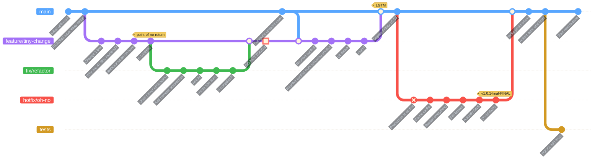

# Hi, I'm Leonardo 👋

Software engineer · Swift veteran · hardware poker · professional rabbit-hole explorer

I’ve spent more than a decade building software, mostly in the Apple ecosystem, but I have a habit of following interesting problems far beyond the application layer.

One day I'm writing SwiftUI. The next I'm driving an NPU's convolution engine from Python, compiling gnuplot to WebAssembly, or turning a resin 3D printer into a PCB exposure unit.

My GitHub is mostly a record of those excursions.

🧪 This is what AI says I like building...

Some representative rabbit holes:

Circuit design tools
Interactive circuit-diagram editing, graph-based connectivity and SPICE integration.

Parsers
NGSPICE, SMILES, SMARTS and experiments with parser combinators.

Scientific simulation
Monte-Carlo / Binary Collision Approximation simulations for ion implantation through multilayer materials.

3D & visualization
SceneKit, Blender, procedural geometry, vehicle visualization and mathematical diagrams.

Embedded & hardware
Cameras, SBCs, Wi-Fi hardware, power systems and assorted devices that usually end up connected to a logic analyzer sooner or later.

AI infrastructure
NPUs, quantization, memory bandwidth, tensor execution and attempts to understand what accelerator hardware is really doing.

Mathematical experiments
Representation learning, unusual storage geometries, information compression and ideas that often begin with:

“This is probably nonsense, but what happens if…?”

🛠️ Around here

Swift · SwiftUI · Objective-C · C/C++ · Go · Python · TypeScript NPUs · INT8 · Quantization · tinygrad · LLVM · WebAssembly Pikchr · PlantUML · Mermaid · gnuplot · Tauri · VS Code extensions ARM · Embedded Linux · ESP8266 · 3D printing · Lean

I use AI to cut the friction between an idea and an experiment. I still read, test and own whatever ends up in the code.

---
📓[reonarudo.github.io](https://reonarudo.github.io)

